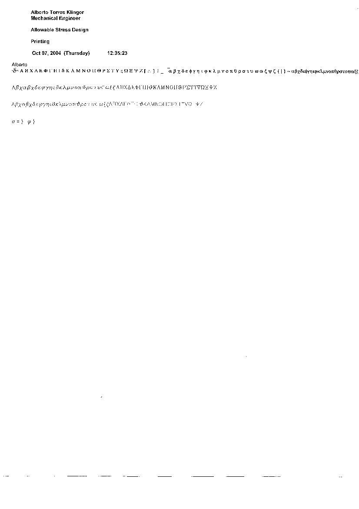



## Printing Special Characters in VB6  \- The Good One

### Description

Replace the first One, I posted wrongly. My Apologies for the Community.

This program print, special characters in different font types like "Symbol", "GreekC", and "GreekS".

Please Accept my apologies
 
### More Info
 
A string

A string in the Font type choosed

No side effects

             |
---                |---
**Submitted On**   |2004-10-09 07:00:46
**By**             |[Alberto Torres](https://github.com/Planet-Source-Code/PSCIndex/blob/master/ByAuthor/alberto-torres.md)
**Level**          |Advanced
**User Rating**    |5.0 (10 globes from 2 users)
**Compatibility**  |VB 5\.0, VB 6\.0
**Category**       |[String Manipulation](https://github.com/Planet-Source-Code/PSCIndex/blob/master/ByCategory/string-manipulation__1-5.md)
**World**          |[Visual Basic](https://github.com/Planet-Source-Code/PSCIndex/blob/master/ByWorld/visual-basic.md)
**Archive File**   |[Printing\_S1802901092004\.zip](https://github.com/Planet-Source-Code/alberto-torres-printing-special-characters-in-vb6-the-good-one__1-56618/archive/master.zip)

### API Declarations

No Api Declarations.

